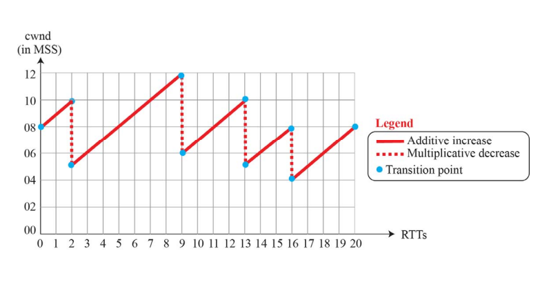
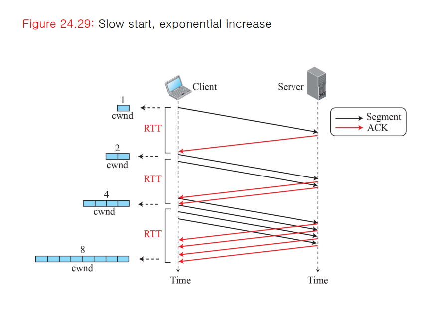
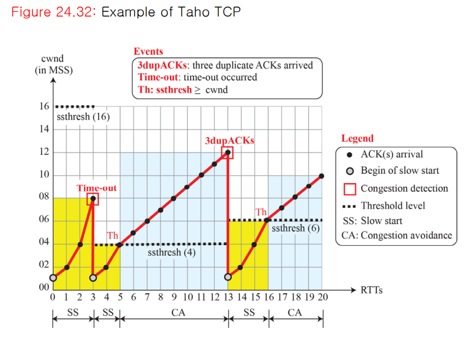
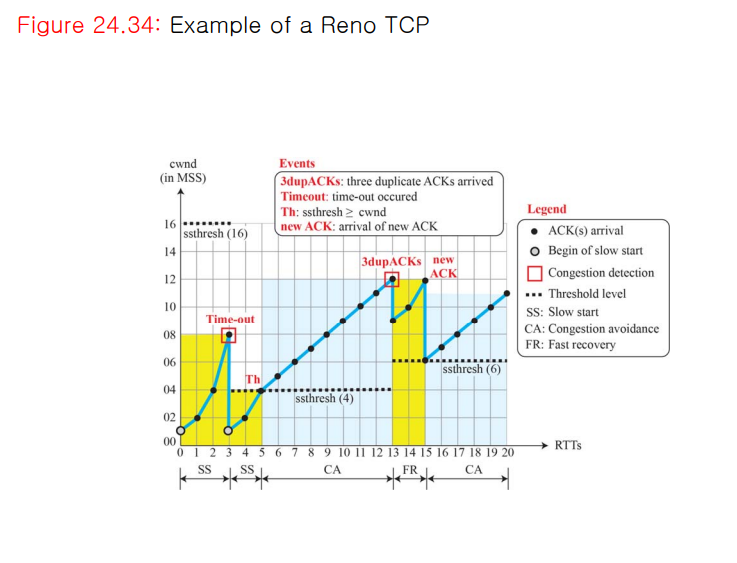

# 서론
전송계층에서는 네트워크계층과는 다르게 상대 호스트의 연결 여부를 확인한 다음 데이터를 보낸다. 
만약, 데이터가 보내질 경로상에 문제가 있거나 호스트에 문제가 있다면 어떻게 해야할까? 이에 대해
전송계층은 흐름제어와 혼잡제어 기법을 제공함으로써 해결한다.

# 흐름제어
만약 수신측이 송신측의 처리 속도를 따라가지 못한다면 어떻게 될까? 처리하지 못한 패킷은 수신 버퍼에
쌓일 것이고, 버퍼의 용량을 넘어서면 패킷은 손실된다. 그렇게 손실된 패킷을 다시 재전송하는 불필요한
작업까지 일어날 수 있기 때문에, 송신측과 수신측의 데이터 처리 속도를 흐름제어 방식으로 해결 할 필요가 있다.
전송계층에서는 2가지 흐름제어 방식을 제공한다.

## 1. Stop and Wait
수신측에서 송신측이 전송한 패킷을 잘 받았다는 ACK를 송신측에 전송하고, 이것이 확인되면 다음 패킷을 전송하는 방법이다.
하지만 패킷을 하나씩 보내기 때문에 비효율적이다.   

## 2. Sliding Window
수신측에서 설정한 윈도우 크기만큼 송신 측에서 ACK없이 패킷을 전송할 수 있게한다. 윈도우 크기를 넘어서면
이전 윈도우에 대한 ACK를 수신측은 송신측에 전달한다.
> 윈도우의 크기는 호스트들이 초기에 통신을 하기 위해 3-way handshaking으로 연결을 맺을 때 수신 측의 윈도우 크기로 설정된다.
> 이후 수신 측의 버퍼 상태에 따라 동적으로 변한다.
#### 동작방식
윈도우의 범위에 포함된 패킷을 전송하고, 수신 측에서 ACK가 오면 윈도우를 옆으로 옮겨 다음 패킷을 전송한다.   

#### 재전송
송신측은 일정시간동안 수신측으로부터 ACK를 받지 못하면, 패킷을 재전송한다. 만약 재전송을 했는데
패킷이 소실된 경우가 아닌 수신 측의 버퍼에 남는 공간이 없는 경우면 문제가 생긴다. 따라서 수신측은
ACK를 보내면서 남은 버퍼의 크기도 함께 보내준다.

# 혼잡제어
혼잡제어는 데이터가 이동하는 경로의 상태를 제어한다. 만약 데이터의 양이 라우터가 처리할 수 있는 양보다
크다면 그 데이터는 손실된다. 이는 곧 송신측의 재전송을 필요로 하며, 불필요한 데이터들이 네트워크상에
계속 쌓이게 된다. 이런 상황은 송신측의 전송 속도를 적절히 조절하여 예방할 수 있는데, 이를 위해 전송계층에서는 
여러 가지 혼잡 제어 기법들을 제공한다.

## 1. AIMD (Additive Increase/Multicative Decrease)
   
AIMD 방식은 처음에 패킷을 하나씩 보내고 문제가 없다면 윈도우의 크기를 1씩 증가시키며 전송한다.
만약 전송에 실패한다면 윈도우의 크기를 반으로 줄인다. 이 방법은 윈도우의 크기를 너무 조금씩 증가시키기 때문에
네트워크의 모든 대역을 활용하여 제대로 된 속도로 통신하기까지 오래 걸린다는 단점이 있다.
## 2. Slow Start

이 방식은 AIMD방식과는 다르게, 윈도우의 크기를 1, 2, 4, 8과 같은 지수적 형태로 증가시킨다.
만약 혼잡이 감지가 되면 윈도우의 크기를 다시 1로 줄인다. 
## 3. Congestion avoidance

이 방식은 slow start에서 ssthresh라는 임계점에 윈도우 크기가 도달했을 때 전환되는 방식이다.
ACK가 수신측으로 부터 전송이되어 확인이 되면, 윈도우의 크기를 1 증가시키고, 혼잡 발생 시 다른 단계로 넘어간다.
## 4. Fast Recovery
이 방식은 혼잡상태에 들어서면, 윈도우의 크기를 1로 줄이지 않고 반으로 줄이고 다시 선형 증가시키는 방법이다.

# TCP Congestion Policy
## 1. Taho TCP
Slow start와 congestion avoidance를 사용한다.
   

먼저 패킷의 크기가 1부터 시작해 8이 되면 Time-out이 발생한다. (slow start) 이후 ssthresh를 Time-out이 발생한
패킷의 길이 * 1/2로 설정하고, 패킷의 길이가 4에 도달하면 이후에는 길이가 1씩 증가한다. (Congestion avodiance) 
만약 어느 지점에서 3개의 중복된 ACK를 수신하게 되면, 네트워크가 혼잡하다고 판단, ssthresh를 혼잡이 발생한
패킷 길이의 1/2로 다시 설정한 후 앞의 과정을 반복한다.
## 2. Reno TCP
   

Taho TCP방식에 Fast Recovery가 추가된 방식이다. Congestion Avodiance까지는 똑같이 동작하나,
만약 3개의 중복된 ACK를 받았다면, 윈도우의 크기를 6 + 3 으로 줄이고 Fast Recovery 상태로 들어간다.
(앞에서 전송된 3개의 패킷을 포함하기 위함인 듯 하다.) 만약 새로운 ACK를 받았다면 윈도우의 크기를
ssthresh로 줄이고 Additive Increase 형태로 증가한다. 하지만 3개의 중복된 ACK가 아닌 Time-out이 발생하면,
Taho와 같이 윈도우의 크기를 1로 줄이게 된다.

참고 자료   
https://steady-coding.tistory.com/507   

Data Communication and Networking[6th]
