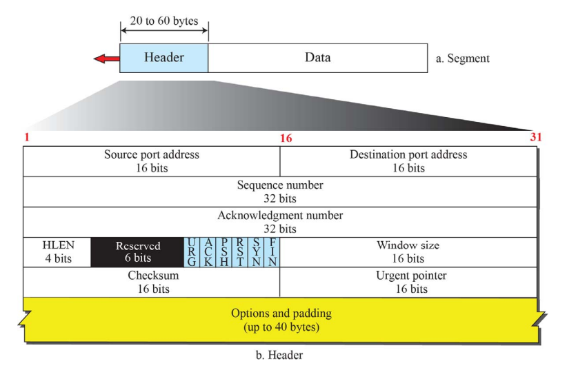

# TCP

Transmission Control Protocol의 약자로, 전송계층에서 사용하는 프로토콜이다. 
같은 계층에서 사용하는 UDP와의 가장 큰 차이점은 상대방과 연결을 맺는다는 점이다.
연결을 맺고 끊는것과 네트워크 제어 부분은 앞의 글에서 다루었으므로, TCP 세그먼트를 중심으로
다루어 볼 것이다.

## TCP Segment
2계층은 datagram, 3계층은 packet이 기본단위이다. 4계층의 데이터 단위는 segment인데,
TCP헤더 + 데이터로 이루어져 있다. 헤더의 길이는 최소 20Byte에서 최대 60Byte이다.   

   
주목해야 할 부분은 중간에 보이는 URG, ACK..등의 영문이니셜로 써져있는 6개의 비트들이다.
이 중에서도 ACK, SYN, FIN에 대해 알아보자.

##### ACK
수신자가 송신자로부터 세그먼트를 받으면, 수신자는 문제없이 받았다는 것을 송신자에게 알리기위해 ACK bit를 설정하여 송신자에게 보낸다.
이 때, 송신자로부터 수신한 Sequence Number를 ACK number field에 담아 전송한다.
##### SYN
TCP를 이용하여 상대방과 연결을 맺으려고 할 때 사용되는 비트이다. SYN비트를 설정하여 상대방에게 연결을 요청하면,
상대는 ACK비트와 SYN비트를 모두 설정하여 연결할 준비가 되었다고 알려준다. 그리고 ACK+SYN비트에 대한 응답으로
상대에게 ACK비트를 설정하여 보낸것이 확인이 되면, 연결이 맺어진다.
##### FIN
통신을 한 후 상대방과 연결을 끊기 위해 사용되는 비트이다. FIN비트를 설정하여 상대방에게 보내면
상대는 ACK비트를 설정하여 연결을 끊는다. 이 때, 단방향으로만 연결이 끊어진 상태라 아직 FIN비트를
보내지 않은 쪽은 연결이 되어있는 상태이다. 따라서, 남아있는 데이터를 더 전송할 수 있고, 양방향으로
연결을 끊고 싶다면 FIN을 설정하여 보내면 된다.