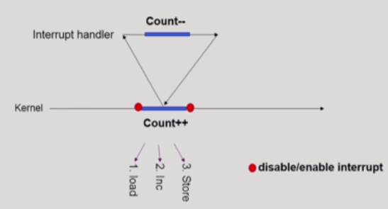

# Process Synchronization

### 데이터의 접근
공유 메모리 주소 공간을 여러 Process(Execution)에서 사용한다면, 커널 내부 데이터를 접근하는 루틴들 간 **Race Condition**의 가능성이 있다. 

### OS에서 race condition 은 언제 발생하는가

1. Kernel 수행 중 인터럽트 발생시   
    
커널 모드 count변수를 처리하는 running 중 interrupt가 발생하여 인터럽트 처리루틴이 수행=>양쪽 다 커널코드이므로 kernel address space를 공유   

2. Process가 system call을 하여 kernel mode로 수행중인데 context switch가 일어나는 경우   
두 프로세스의 address space간에는 data sharing이 없음.   
그러나 system call을 하는 동안에는 kernel address space의 data를 access하게됨(share)   
이 작업 중간에 cpu를 preempt를 하게되면 race condition   
**해결책** : 커널 모드에서 수행중일 때는 cpu를 preempt하지 않고, 커널모드에서 사용자 모드로 돌아갈 때 preempt

3. Multiprocessor에서 shared memory 내의 kernel data
  어떤 CPU가 마지막으로 data를 store 했는가?=> race condition   
  multiprocessor의 경우 interrupt enable/disalbe로 해결되지 않음. 
CPU가 여러개있는 환경에서는 어떻게 작동할까?   
**해결책** :
   1. 한번에 하나의 CPU만이 커널에 들어갈 수 있게하는 방법
   2. 커널 내부에 있는 각 공유 데이터에 접근할 때마다 그 데이터에 대한 lock/unlock을 하는 방법

## Process Synchronization 문제
- 공유 데이터(shared data)의 동시접근(concurrent access)은 데이터의 불일치 문제(inconsistency)를 발생시킬 수 있다.

- 일관성(consistency) 유지를 위해 협력프로세스간의 실행순서를 정해주는 메커니즘 필요

- Race Condition
  - 여러 프로세스들이 동시에 공유 데이터를 접근하는 상황
  - 데이터의 최종 연산 결과는 마지막에 그 데이터를 다룬 프로세스에 따라 달라짐
-race condition을 막기 위해서는 concurrent process는 동기화되어야 한다.

## The Critical-Section Problem(임계구역)
Critical Section: 공유데이터에 접근하는 코드

- n개의 프로세스가 공유데이터를 동시에 사용하기를 원하는 경우
- 각 프로세스의 code segment에는 공유데이터를 접근하는 코드인  critical section이 존재
- problem : 하나의 프로세스가 critical section에 있을때 다른 모든 프로세스는 critical section으로 들어갈 수 없어야 한다.