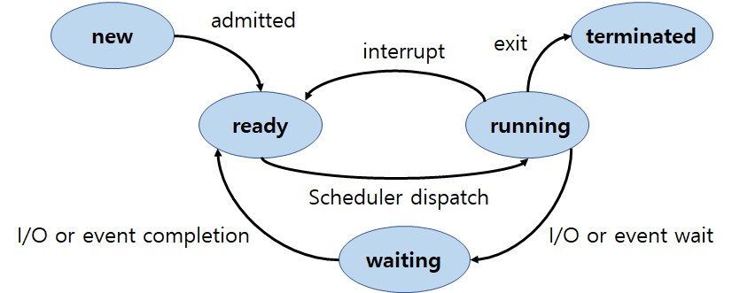
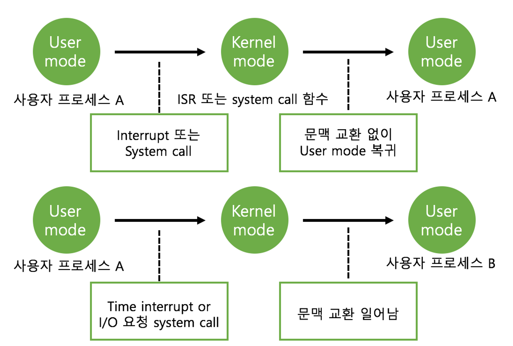

# Process 1

a program in execution

## process Context는

- cpu 수행 상태를 나타내는 Program Counter, Register
- 프로세스의 주소 공간인 code, data, stack
- 프로세스 (운영체제)관련 커널 자료 구조인 PCB, Kernel stack(process마다 다름)

## Process State

- Running : CPU를 잡고 instruction을 수행중인 상태
- Ready : CPU를 기다리는 상태
- Blocked(wait, sleep) : CPU를 주어도 당장 명령을 수행할 수 없는 상태
- New : 프로세스가 생성중인 상태
- Terminated : execution이 끝난 상태
- Suspended : 아래 Medium-term scheduler에 설명

    
  

## Process Control Block(PCB)

운영체제가 각 프로세스를 관리하기 위해 프로세스 당 유지하는 정보(구조체로 유지)

- OS가 관리상 사용하는 정보 : Process state, Process ID, scheduling information, priority
- CPU 수행 관련 하드웨어 값 : Program counter, registers
- 메모리 관련 : code, data, stack 위치 정보
- 파일 관련

## Context Switch

CPU를 한 프로세스에서 다른 프로세스로 넘겨주는 과정
프로세스의 상태를 그 프로세스의 PCB에 저장, cPU를 새롭게 얻는 프로세스의 상태를 PCB에서 읽어옴(program counter 등을 저장후 다음에 읽어와서 하드웨어에 복원 후 CPU를 받음)

- 시스템 콜이나 interrupt 발생 시 반드시 context switch가 일어나는 것은 아님   

  

## Scheduling Queue

- Job Queue : 현재 시스템 내에 있는 모든 프로세스 집합(프로세스가 시스템에 들어오면 이 큐에 넣어짐)
- Ready Queue : 현재 메모리 내에 있으면서 CPU를 잡아서 실행되기를 기다리는 프로세스 집합
- Device Queue : I/O device의 처리를 기다리는 프로세스 집합(waiting 상태의 프로세스)

## Scheduler

### - Long-term scheduler(or job scheduler)

시작 프로세스 중 어떤 것들을 ready queue로 보낼지 결정(=프로세스에 메모리를 할당하는 문제 결정)

degree of Multiprogramming을 제어(=메모리에 올릴 프로세스의 수 제어)

time sharing system에는 보통 장기 스케쥴러가 없음(무조건 ready)

현재는 장기 스케줄러는 사용되지 않음. 시작할 때 바로 메모리를 줌

### - Short-term scheduler(or CPU scheduler)

어떤 프로세스를 다음번에 running시킬지 결정(= CPU를 할당하는 문제 결정)   

빨라야함(millisecond 단위)   

짧은 시간 단위로 스케쥴이 실행됨

### - Medium-term scheduler(Swapper)

장기 스케줄러가 없는 대신 여유 공간 마련을 위해 프로세스를 통째로 메모리에서 디스크로 쫓아냄.

프로세스에게서 메모리를 뺏는 문제.

degree of Multiprogramming을 제어(=이미 메모리에 올라와 있는 프로세스의 수 제어)

=> 프로세스 상태가 하나 추가된다.
**Suspended(stopped)** : 외부적인 이유로 프로세스의 수행이 정지된 상태. 프로세스는 통째로 디스크에 swap out 된다.
Blocked=> 자신이 요청한 event가 만족되면 Ready
Suspended=> 외부에서 resume해 주어야 Active

---
이미지 참고   
https://80000coding.oopy.io/ef52431e-cf52-497b-824f-bcb365144c7a   
https://chlgpdus921.github.io/operating%20system/Chapter2_Process/
